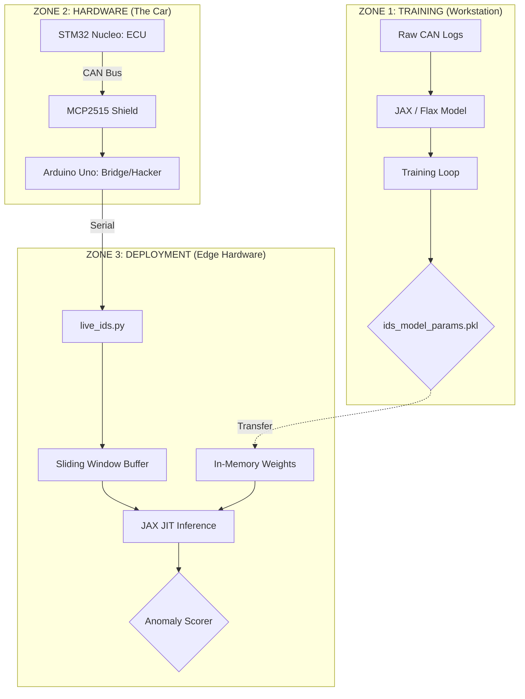

# Real-Time CAN Bus IDS using Mini-GPT and JAX

A Cyber-Physical Intrusion Detection System (IDS) that uses a Transformer (Mini-GPT) to detect anomalies on a vehicle's CAN Bus by learning temporal signal correlations.

## 🏗️ Architecture



## 🚀 Overview
* **The Concept:** Unlike rule-based systems, this model learns the "Laws of Physics" of the vehicle. When an attacker injects fake data (e.g., 200km/h while in 1st gear), the prediction error spikes significantly.
* **Training:** Performed using **JAX/Flax** for high-speed sequence learning.
* **Detection:** Raspberry Pi 4 runs real-time inference using **JIT-compiled JAX code** to meet CAN bus timing requirements.
* **Hardware:** STM32 simulates vehicle physics; Arduino Uno acts as a gateway and potential injection point for testing.

## 📂 Repository Structure
```text
.
├── deployment_pi/
│   ├── ids_model_params.pkl    # Trained model weights
│   └── live_ids.py             # Real-time inference script
├── training_mac/
│   ├── ids_minigpt_train.py    # Model architecture & training logic
│   ├── prepare_data.py         # Data preprocessing
│   └── vehicle_data.csv        # Sample telemetry dataset
├── requirements_mac.txt        # Development dependencies
└── requirements_pi.txt         # Edge deployment dependencies
```

## 📊 Results
During testing, the injection of out-of-sequence speed data resulted in a **44x increase** in Mean Squared Error (MSE). This allows for high-confidence anomaly detection without relying on static, easily-bypassed thresholds.

## 🔌 Hardware Setup
* **ECU Simulator:** STM32 Nucleo broadcasting Speed, RPM, and Gear telemetry.
* **Hacker Node:** Arduino Uno + MCP2515 Shield (acts as Serial bridge and injection point).
* **IDS Node:** Raspberry Pi 4 (8GB) running the JAX inference engine.

## 🏃 How to Run

### 1. Training
```bash
cd training_mac
pip install -r ../requirements_mac.txt
python3 ids_minigpt_train.py
```

### 2. Deployment
Ensure the `ids_model_params.pkl` is in the `deployment_pi` folder.
```bash
cd deployment_pi
pip install -r ../requirements_pi.txt
python3 live_ids.py
```
